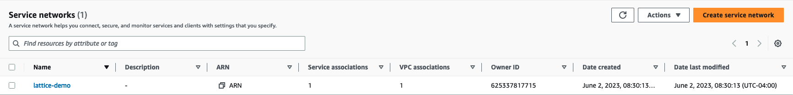
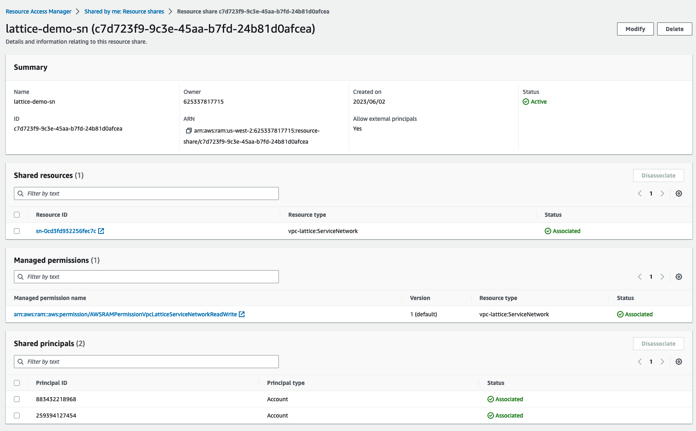
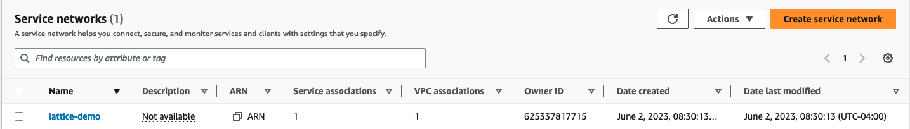
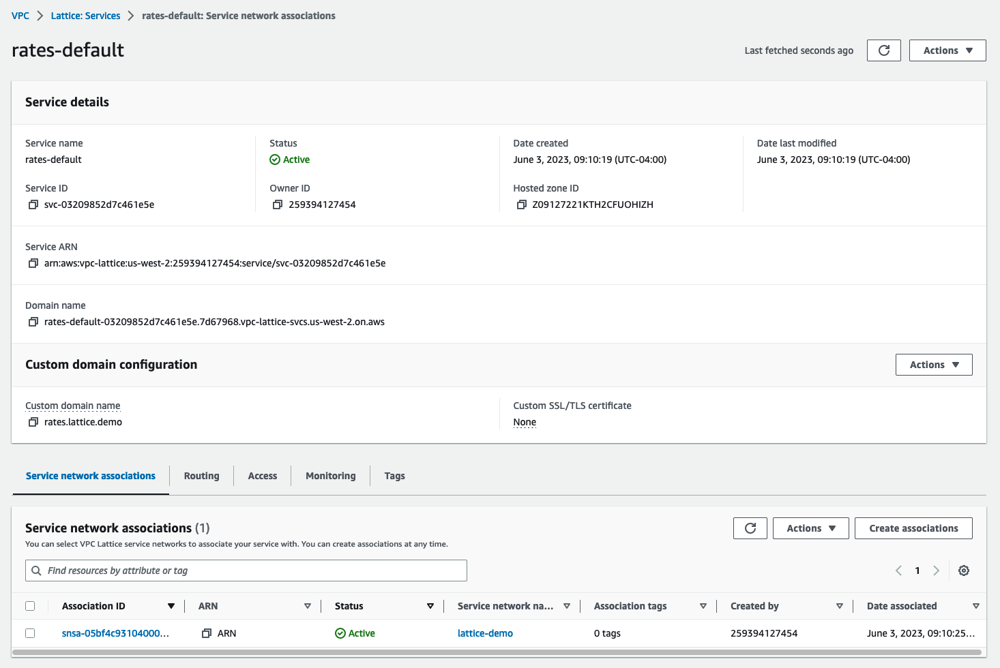
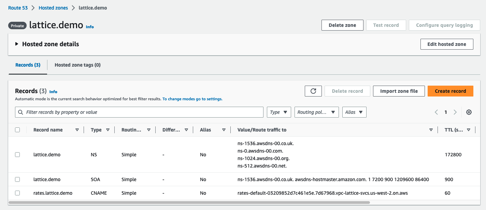

# lattice-eks-lambda-blog
VPC Lattice Integration with Amazon EKS &amp; AWS Lambda

## Pre-requisites

* AWS Account

* [eksctl](https://eksctl.io/) – a simple CLI tool for creating and managing Amazon EKS clusters.

* [sam cli](https://docs.aws.amazon.com/serverless-application-model/latest/developerguide/install-sam-cli.html) - is a toolkit that improves the developer experience of building and running serverless applications on AWS

* [kubectl](https://kubernetes.io/docs/tasks/tools/#kubectl) - a simple CLI tool that allows you to run commands against Kubernetes clusters.

## Create a VPC Lattice Service Network

* Login to your `Central Networking AWS Account`
* Create a CloudWatch log group to store the VPC Lattice Service Network logs

```shell
aws logs create-log-group --log-group-name lattice-demo-logs
# Export CW Log Group Name
export LOG_GROUP_ARN=$(aws logs describe-log-groups --log-group-name-prefix lattice-demo-logs --output text --query 'logGroups[0].arn')
```

* Create a Service Network

```shell
export LATTICE_ARN = $(aws vpc-lattice create-service-network --name lattice-demo --query 'arn' --output text)
# Create Access log Subscription
aws vpc-lattice create-access-log-subscription --resource-identifier $LATTICE_ARN --destination-arn $LOG_GROUP_ARN
```




* Share the Service Network with EKS & Lambda AWS Accounts

```shell
aws ram create-resource-share --name lattice-demo-sn --resource-arns $LATTICE_ARN --principals 883432218968 259394127454
```



### EKS Cluster Setup

* Login to your `EKS Platform AWS Account`
* Create an EKS cluster by running the below command:

```shell
eksctl create cluster -f eks.yaml
```

* Update the Security Group ingress rules to authorize traffic from VPC Lattice Prefix list

```shell
export AWS_REGION=us-west-2
export CLUSTER_NAME=lattice-demo
PREFIX_LIST_ID=$(aws ec2 describe-managed-prefix-lists --query "PrefixLists[?PrefixListName=="\'com.amazonaws.$AWS_REGION.vpc-lattice\'"].PrefixListId" | jq -r '.[]')
MANAGED_PREFIX=$(aws ec2 get-managed-prefix-list-entries --prefix-list-id $PREFIX_LIST_ID --output json  | jq -r '.Entries[0].Cidr')
CLUSTER_SG=$(aws eks describe-cluster --name $CLUSTER_NAME --output json| jq -r '.cluster.resourcesVpcConfig.clusterSecurityGroupId')
aws ec2 authorize-security-group-ingress --group-id $CLUSTER_SG --cidr $MANAGED_PREFIX --protocol -1
```

* Create an IAM Policy to manage the VPC Lattice resources, this is used by `AWS Gateway API controller` addon

```shell
aws iam create-policy \
   --policy-name VPCLatticeControllerIAMPolicy \
   --policy-document file://manifests/lattice-iam.json
export VPCLatticeControllerIAMPolicyArn=$(aws iam list-policies --query 'Policies[?PolicyName==`VPCLatticeControllerIAMPolicy`].Arn' --output text)
```

* Create the k8s namespace to deploy the `AWS Gateway API controller` addon

```shell
kubectl apply -f manifests/lattice-ns.yaml
```

* Create an IAM Role with `VPCLatticeControllerIAMPolicy` permissions and attach it to the k8s service account.

```shell
eksctl create iamserviceaccount \
   --cluster=$CLUSTER_NAME \
   --namespace=aws-application-networking-system \
   --name=gateway-api-controller \
   --attach-policy-arn=$VPCLatticeControllerIAMPolicyArn \
   --override-existing-serviceaccounts \
   --region $AWS_REGION \
   --approve
```

* Deploy the `aws-application-networking-controller` addon

```shell
kubectl apply -f manifests/deploy-v0.0.12.yaml
```

Verify the status of the deployment.

```shell
kubectl get all -n aws-application-networking-system
```

```
NAME                                          READY   STATUS    RESTARTS   AGE
pod/gateway-api-controller-7b988c5868-l8gcj   2/2     Running   0          2d11h

NAME                                             TYPE        CLUSTER-IP      EXTERNAL-IP   PORT(S)    AGE
service/gateway-api-controller-metrics-service   ClusterIP   10.100.180.71   <none>        8443/TCP   2d11h

NAME                                     READY   UP-TO-DATE   AVAILABLE   AGE
deployment.apps/gateway-api-controller   1/1     1            1           2d11h

NAME                                                DESIRED   CURRENT   READY   AGE
replicaset.apps/gateway-api-controller-7b988c5868   1         1         1       2d11h
```

* Create the amazon-vpc-lattice Gateway class:

```shell
kubectl apply -f manifests/gatewayclass.yaml
```

### Deploy the Sample App and Gateway resources on EKS cluster

* Verify the Service Network is shared with the `EKS Platform AWS Account`



* Deploy the Gateway manifest to associate the `lattice-demo` service network with EKS VPC

```shell
kubectl apply -f manifests/gateway.yaml
```

* Deploy the sample applications on the EKS cluster - `parking`, `review`

```shell
kubectl apply -f manifests/parking.yaml
kubectl apply -f manifests/review.yaml
```

* Create `HTTPRoute` resource to expose the sample apps in the VPC Lattice Service Network

```shell
kubectl apply -f rate-route-path.ymal
```

* `AWS Gateway API` controller will provision necessary VPC Lattice Service resources in few minutes, you can find the Lattice service host name using below command:

```shell
kubectl get httproute rates -o jsonpath='{.status.parents[?(@.controllerName=="application-networking.k8s.aws/gateway-api-controller")].conditions[0].message}'
```
DNS Name: `rates-default-03209852d7c461e5e.7d67968.vpc-lattice-svcs.us-west-2.on.aws`



* Test the connectivity from a sample client running on the EKS Cluster

```shell
kubectl run curl-debug --rm -i --tty --restart=Never --image=curlimages/curl -- http://rates-default-03209852d7c461e5e.7d67968.vpc-lattice-svcs.us-west-2.on.aws/parking
```

Output
```console
Requsting to Pod(parking-59c9fdb57f-8jqtj): parking handler pod
pod "curl-debug" deleted
```

### Create Route 53 Hosted Zone

* Create Private R53 hosted zone and associate it with the EKS VPC

```shell
EKS_VPC_ID=$(aws ec2 describe-vpcs --region "$AWS_REGION"  --filters 'Name=tag:Name,Values="eksctl-lattice-demo-cluster/VPC"' | jq -r '.Vpcs[].VpcId')
aws route53 create-hosted-zone --name lattice.demo --region $AWS_REGION --hosted-zone-config PrivateZone=true --vpc VPCId=$EKS_VPC_ID,VPCRegion=$AWS_REGION --caller-reference $(date '+%Y-%m-%d-%H-%M-%S')
```

* Create a CNAME record to provide a vanity name `rates.lattice.demo` to the Lattice generated domain name

```shell
HZ_ID=$(aws route53 list-hosted-zones --query 'HostedZones[?Name==`lattice.demo.`].Id' --output text)
LATTICE_DNS=$(aws vpc-lattice list-services --query 'items[?name==`rates-default`].dnsEntry.domainName' --output text)
aws route53 change-resource-record-sets --hosted-zone-id $HZ_ID --region $AWS_REGION --change-batch "{\"Changes\": [{\"Action\": \"CREATE\", \"ResourceRecordSet\": {\"Name\": \"rates.lattice.demo\", \"Type\": \"CNAME\", \"TTL\": 60, \"ResourceRecords\": [{ \"Value\": \"$LATTICE_DNS\"}] } }]}"
```



### Setup Lambda Client

* Login to your `EKS Platform AWS Account`
* Provision an Amazon API Gateway and AWS Lambda resources by running the below command:

```shell
EKS_SG=$(aws eks describe-cluster --name $CLUSTER_NAME --output json| jq -r '.cluster.resourcesVpcConfig.clusterSecurityGroupId')
EKS_VPC_ID=$(aws ec2 describe-vpcs --region "$AWS_REGION"  --filters 'Name=tag:Name,Values="eksctl-lattice-demo-cluster/VPC"' | jq -r '.Vpcs[].VpcId')
PRIVATE_SUBNETS_LIST=($(aws ec2 describe-subnets --filters Name=vpc-id,Values=$EKS_VPC_ID --query 'Subnets[?MapPublicIpOnLaunch==`false`].SubnetId' --output text))

sam deploy --parameter-overrides SubnetIdsParameter="${PRIVATE_SUBNETS_LIST[1]},${PRIVATE_SUBNETS_LIST[2]},${PRIVATE_SUBNETS_LIST[3]}" EKSSGParameter="${EKS_SG}"
```

### Test the connectivity

```shell
curl https://7zxne5divi.execute-api.us-west-2.amazonaws.com/Prod/lattice-demo/parking
```
```output
Requsting to Pod(parking-59c9fdb57f-wkpjf): parking handler pod
```
```shell
curl curl https://7zxne5divi.execute-api.us-west-2.amazonaws.com/Prod/lattice-demo/review
```
```output
Requsting to Pod(review-766b6c9bf5-jrdp4): review handler pod
```

### Cleanup

*TODO*
